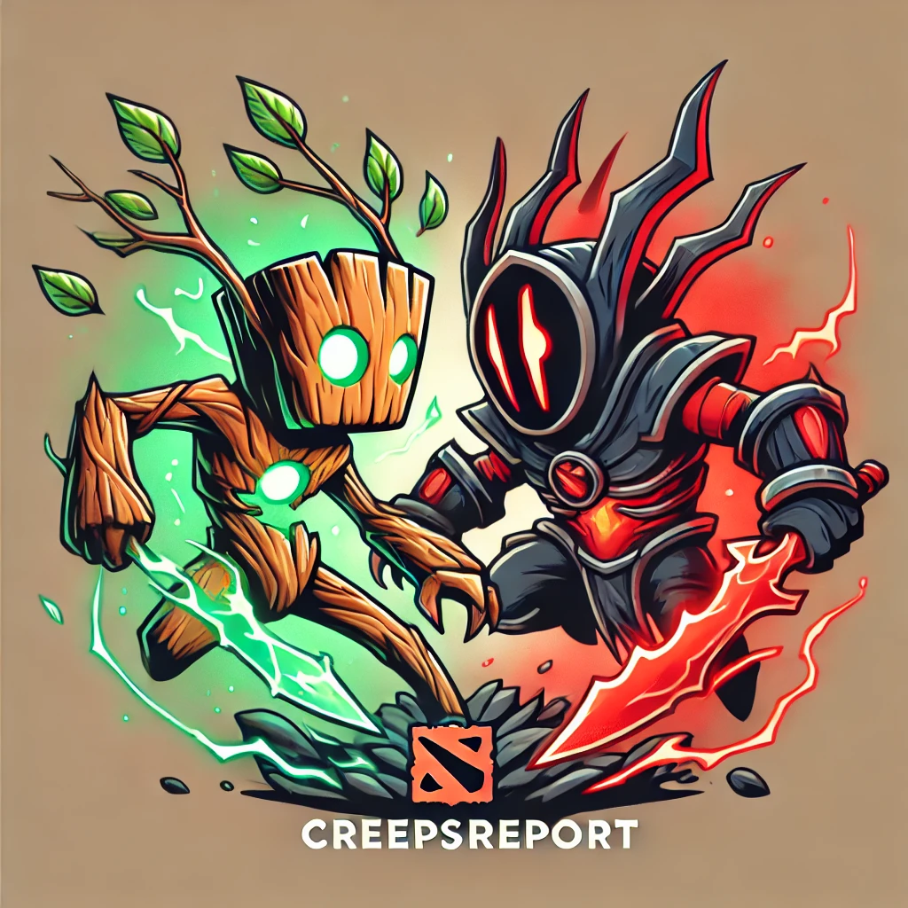
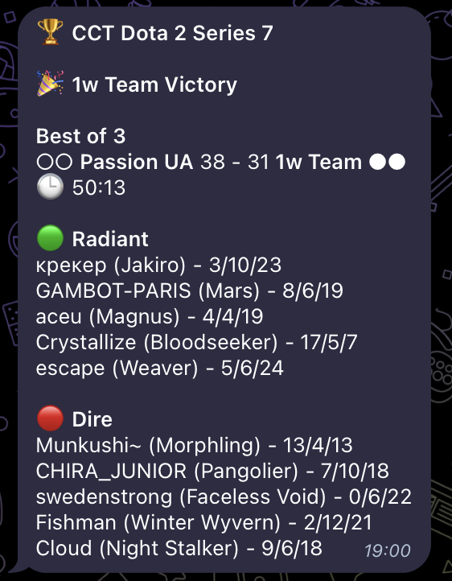

<h1>👋 Hello, this is CreepsReport!</h1>

And I can bring you the results of the latest professional Dota2 matches as quick as possible! 

<h1>1. I'm obviously a Telegram bot</h1>

And I live here: [@creeps_report_bot](https://t.me/creeps_report_bot)

<strong>I think you should learn some simple commands to work with me!</strong>

<h3> 📝 List of possible and your current subscriptions to teams: <code>/team_subscriptions</code> </h3>

Typing this in the chat will show you the list of currently active professional teams (who have played at least 1 match in the last six months):

<pre>
❌ Gaimin Gladiators - to subscribe: /team_subscribe Gaimin Gladiators
✅ Team Spirit - to unsubscribe: /team_unsubscribe Team Spirit
</pre>

As you can guess, we currently have a subscription to <i>Team Spirit</i> and we don't have a subscription to <i>Gaimin Gladiators</i>.
We can change this. You can click on a suggested command which will copy it to the buffer and then paste it. Let's discuss it further.

<h3> ❤️ Subscribe to the team's match results: <code>/team_subscribe {team_name}</code> </h3>
Typing, for example, <code>/team_subscribe Gaimin Gladiators</code> will subscribe you to that team's updates. Simple.

<h3> 💔 Unsubscribe from the team's match results: <code>/team_unsubscribe {team_name}</code> </h3>
Typing, for example, <code>/team_unsubscribe Team Spirit</code> will unsubscribe you from that team's updates. Simple too.

<h2>Ok. What do the team's match result mean? I'd rather show you</h2>

Once some match of one of the teams you are subscribed to ends, the bot will send your a message like that:

What we can see here:

- firstly, the name of the tournament
- then, the winner of the match
- type of series  (can be Bo1, Bo2, Bo3, Bo5, you know that!)
- the score in the series indicated by these circles: ○, ⚪; the filled one means 1 win in the series
- match score
- match duration
- Radiant vs Dire teams with each player's score

<h3>That's it for now. Stay tuned for updates!</h3>

<h1>2. Development</h1>

Just docker and docker-compose. Nothing else.

[Air](https://github.com/air-verse/air) will do all the rebuilding work for you!

The data is fetched from [OpenDOTA API](https://docs.opendota.com/)

<h3>Environment variables</h3>

TODO: more variables

- <code>AIR_PORT</code> - if you need a non-standard port to use Air
- <code>TELEGRAM_BOT_TOKEN</code> - the token you got from [@BotFather](https://t.me/BotFather)
- <code>TELEGRAM_BOT_ADMIN</code> - telegram tag of the bot admin without <code>@</code>
- <code>FETCH_RECENT_MATCHES_TIMEOUT</code> - the value in seconds of how often the latest matches will be parsed (this value will affect the delay with which we receive results)

<h3>CLI commands</h3>

- <code>go run ./cmd/runmigrations/main.go</code> - run migrations
- <code>go run ./cmd/fetchteams/main.go</code> - parse teams
- <code>go run ./cmd/activateteams/main.go</code> - make some teams active manually. Supports multiple teams divided by space. Spaces in the team name should be replaced by "_". For example: <code>go run ./cmd/activateteams/main.go LGD_Gaming</code>
- <code>go run ./cmd/deactivateteams/main.go</code> - make some teams inactive manually. Supports multiple teams divided by space. Spaces in the team name should be replaced by "_". For example: <code>go run ./cmd/activateteams/main.go LGD_Gaming</code>
